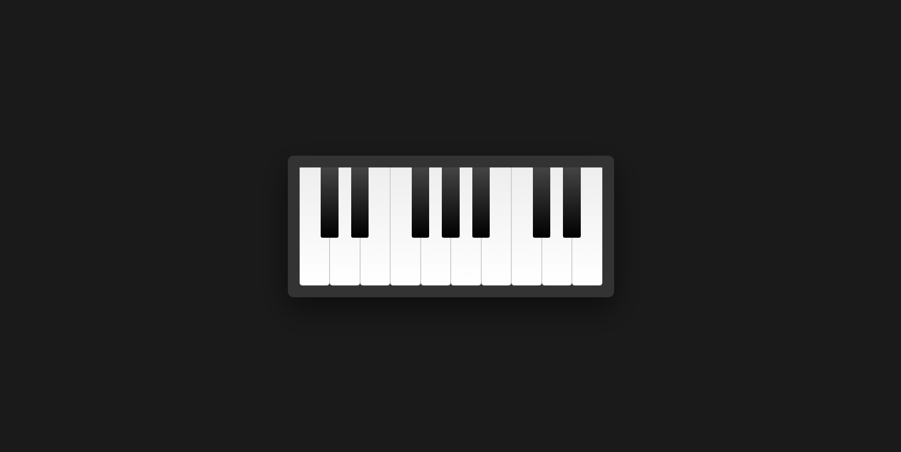

# 🎹 Piano Launchpad

Интерактивная виртуальная пианино-клавиатура, созданная на HTML, CSS и JavaScript.

Проект позволяет воспроизводить звуки при клике на клавиши и визуально имитирует настоящую клавиатуру пианино.

## 📌 О проекте

Piano Launchpad — это мини-приложение, в котором:

Реализованы белые и чёрные клавиши

Каждая клавиша воспроизводит отдельный звук

Есть визуальный эффект нажатия

Можно быстро нажимать клавиши подряд (звук не обрывается)

Проект демонстрирует работу с:

DOM

обработчиками событий

классами CSS

объектом Audio в JavaScript

## 🎵 Как работает логика

Все клавиши имеют класс .key.

У каждой клавиши есть атрибут data-sound, содержащий путь к mp3-файлу.

При клике:

создаётся новый объект Audio

звук воспроизводится

добавляется класс playing

Через 100 мс класс удаляется — создаётся эффект нажатия.

## 🛠 Используемые технологии

HTML5

CSS3 (Flexbox, градиенты, тени)

JavaScript (Vanilla JS)

Web Audio через Audio()

[Demo](https://meek-griffin-e3994b.netlify.app/)
